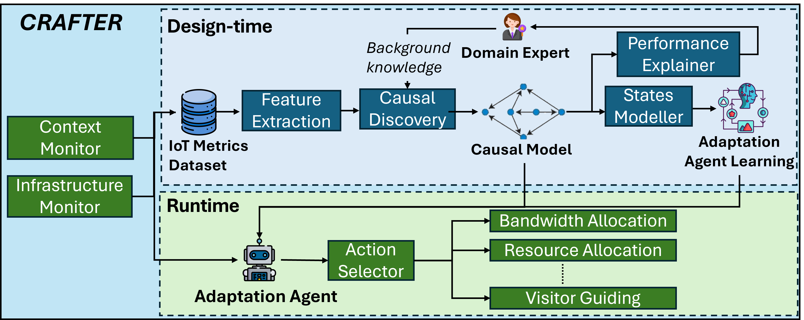

# CRAFTER: Causality-based Self-adaptation for Autonomous IoT Systems

## Project Description
CRAFTER enables causal-based adaptation for self-adaptive IoT systems. This is achieved by (i) using causal discovery to generate causal graphs showing cause-effect relationships in IoT systems, and (ii) using Reinforcement Learning for taking adaptation actions at runtime. 
This repository contains the source code of the CRAFTER implementation, along with an emulated network environment for using and testing CRAFTER.
CRAFTER's high-level architecture is shown in the figure below.
.

## Getting Started
This repository contains the following directories:
- `iot-simulator`: contains the code for simulating an end-to-end IoT system.
- `deployments`: contains deployment files that specify the system properties in each smart space location (i.e., type and number of devices, virtual sensors, and applications)
- `causal-discovery`: contains the dataset and their generated causal graphs.
- `RL`: contains the RL models CRAFTER uses, and the datasets they're trained on.
- `scripts`: contains scripts for running experiments, generating causal graphs, training RL models, and plotting results.
- `results`: is used to save results when running simulations.

### Installation Requirements
This artifact has been prepared for a host machine running  [Ubuntu 20.04 LTS](https://releases.ubuntu.com/focal/). In addition, you should install  [jdk-17](https://www.oracle.com/fr/java/technologies/downloads/#java17),  [Maven 3.8.9](https://maven.apache.org/docs/3.8.9/release-notes.html),  [Docker](https://docs.docker.com/engine/install/ubuntu/),  [Python3](https://www.python.org/downloads/), and  [Containernet](https://containernet.github.io/). 

**N.B**: when installing  _Containernet_, please do so using the Bare-metal installation option (Option 1). Using the nested Docker deployment option (Option 2) may generate errors when running experiments.

## Running Experiments with CRAFTER
This section provides instructions for running a sample experiment with CRAFTER given predefined IoT system specifications. 

### Building Docker Images

To emulate the underlying network infrastructure among different hosts, we use  [Containernet](https://containernet.github.io/), a fork of the famous  [Mininet](https://mininet.org/)  network emulator which allows to use Docker containers as hosts in emulated network topologies. For this purpose, we build the different components of the IoT system as Docker images. To build the Docker images, start by cloning this repository:  
`$ git clone https://github.com/houssamhh/crafter.git`  
You can now build the Docker images needed for running the experiments (please make sure that you use the same tags for the images as follows):
```
$ docker build -f emqx.Dockerfile -t emqx-new .
$ docker build -f location.Dockerfile -t location .
```
You can verify that all images have been correctly built by listing all Docker images: `$ sudo docker image ls`.

### Running Simulations with Containernet

We use the Containernet Python API to create the network topology of our system. The script for defining the topology can be found in  `experiments/experimental_framework.py`. 
To start the experiment, you can run the following command:
 `$ sudo ./scripts/runMininet.sh`.
 Once the script is successfully run, latency measurements for IoT data flows will start.

### Generating causal graphs
We use the PC algorithm to generate causal graphs with causal discovery. For this purpose, you can run the `extract_causal_graph.py` script found in the `scripts` directory:
`$ python3 ./scripts/extract_causal_graph.py`.
This script will generate the causal graph found in `causal-discovery/graph.png`.

### Training the Adaptation Agent
To train the adaptation agent, you can run the `trainAgents.py` script in the `scripts` directory:
`$ python3 trainAgents.py`.
The trained model will be saved in the `RL/iot/models` directory. The model can then be used to take adaptation decisions when changes occur in the smart environment.
 